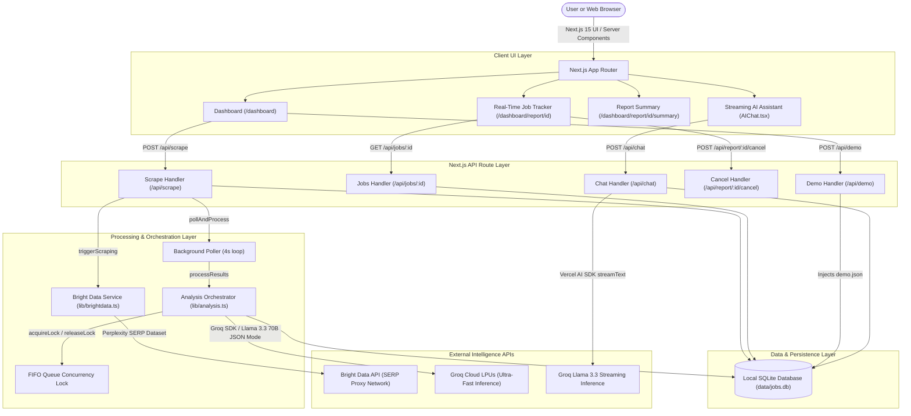
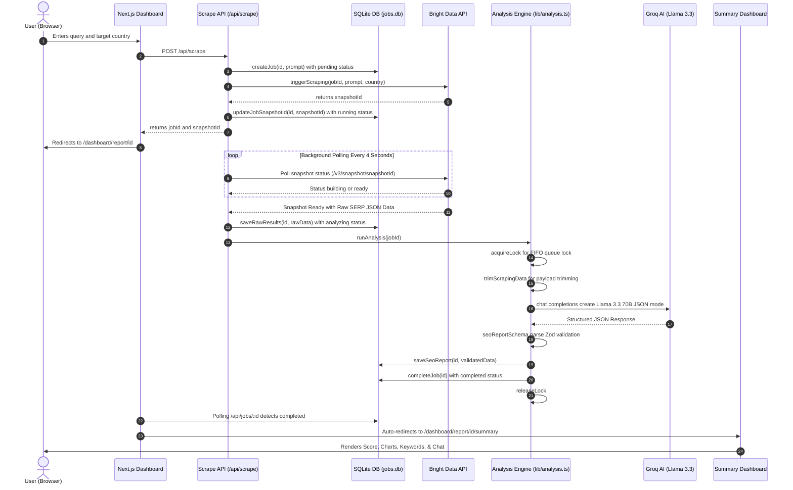
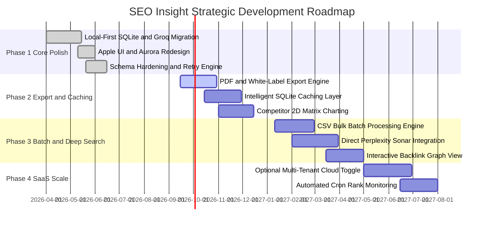

# 🌐 SEO Insight: Complete Project Overview & Technical Architecture

**Author & Lead Architect:** Aditya & Antigravity AI  
**Project Version:** 4.2 (Enterprise Local-First Edition)  
**Last Updated:** September 2026  
**Documentation Location:** `/docs/PROJECT_OVERVIEW.md`

---

## 📑 Table of Contents

1. [Executive Summary & Project Philosophy](#1-executive-summary--project-philosophy)
2. [Target Audience & Core Use Cases](#2-target-audience--core-use-cases)
3. [System Architecture & Technical Stack](#3-system-architecture--technical-stack)
4. [End-to-End Execution Flow & Algorithmic Pipeline](#4-end-to-end-execution-flow--algorithmic-pipeline)
5. [Design System & Apple UI UX Context](#5-design-system--apple-ui-ux-context)
6. [Data Schemas, Validation & Type Safety](#6-data-schemas-validation--type-safety)
7. [Engineering Safeguards & Resilience Mechanisms](#7-engineering-safeguards--resilience-mechanisms)
8. [Comprehensive Project Roadmap & Future Scope](#8-comprehensive-project-roadmap--future-scope)
9. [Developer Guide, File Taxonomy & API Reference](#9-developer-guide-file-taxonomy--api-reference)
10. [Quick Start & Operational Instructions](#10-quick-start--operational-instructions)

---

## 1. Executive Summary & Project Philosophy

### 1.1 What is SEO Insight?
**SEO Insight** is a high-velocity, local-first search engine intelligence and entity analysis platform. It allows businesses, founders, SEO professionals, and developers to perform deep SERP (Search Engine Results Page) research, competitor analysis, keyword extraction, and AI-powered strategic auditing—without relying on recurring multi-hundred-dollar SaaS subscriptions or centralized cloud storage.

By combining **Bright Data's Web Scraping APIs** with **Groq's LPU (Language Processing Unit) inference** running **Llama 3.3 70B**, SEO Insight aggregates live web search data and transforms unstructured web content into actionable, presentation-grade intelligence reports within seconds.

| Pillar | Technology | Value Proposition |
| :--- | :--- | :--- |
| 🔒 **Data Privacy** | Local SQLite (`data/jobs.db`) | 100% data sovereignty with zero external cloud tracking or storage |
| ⚡ **Velocity & Speed** | Groq LPU (Llama 3.3 70B) | < 5 second full 35-point structured SEO audit generation |
| 🎨 **Apple-Grade Visuals** | Glassmorphism & Aurora UI | Modern dark mode with responsive Recharts and real-time streaming AI chat |

### 1.2 Core Architectural Pillars

1. **Complete Data Sovereignty (Local-First Architecture)**
   - No external user tracking, no forced authentication walls (Clerk removed for local standalone velocity), and no cloud databases holding proprietary research.
   - All scraping jobs, historical audits, and generated reports reside locally in SQLite (`data/jobs.db`).
2. **Extreme Inference Velocity**
   - Traditional LLM cloud calls take 20–45 seconds to generate deep analytical JSON schemas. Groq’s LPU hardware delivers token throughput in excess of 250 tokens/sec, reducing full report synthesis to under 5 seconds.
3. **Defensive Schema Hardening**
   - Large Language Models are prone to structural drift. SEO Insight implements a resilient Zod validation layer with fallback preprocessors that catch, normalize, and heal data on the fly, guaranteeing zero UI runtime errors.
4. **Apple-Inspired Design Language**
   - High-fidelity dark mode with dynamic Aurora gradients, backdrop filters (24–32px blurs), refined typography, and responsive Recharts data visualizations.

---

## 2. Target Audience & Core Use Cases

### 2.1 Target Personas

| Persona | Primary Goal | How SEO Insight Solves It |
| :--- | :--- | :--- |
| **SEO Specialists & Consultants** | Rapid client brand audits and backlink discovery. | Generates complete entity health reports with source attribution in minutes. |
| **Indie Hackers & Founders** | Competitive intelligence for new product launches. | Discovers domain overlaps, keyword intent clusters, and market gaps. |
| **Digital Marketing Agencies** | Scalable reporting without seat-based pricing. | Uses direct API keys with zero per-seat licensing costs. |
| **Content Strategists** | Keyword clustering and search intent mapping. | Automatically classifies queries into Informational, Navigational, Commercial, and Transactional clusters. |
| **Developers & Researchers** | Programmatic search intelligence and LLM data ingestion. | Clean SQLite storage with structured JSON payloads ready for downstream automation. |

### 2.2 Core Use Cases

#### 🎯 Use Case 1: Comprehensive Brand & Entity Health Audit
- **Scenario:** An agency wants to evaluate the digital presence of a target entity (e.g., "Linear.app" or a personal brand).
- **Execution:** User submits the entity name with geographic targeting (e.g., US, UK, DE). The system triggers a deep search, gathers cross-platform citations (socials, news, podcasts, docs), computes an SEO health score (0–100), and outputs key strengths and critical weaknesses.

#### ⚔️ Use Case 2: Competitor Landscape & Gap Extraction
- **Scenario:** A founder needs to know who ranks for the same search intent and what unique advantages those competitors hold.
- **Execution:** The AI extracts competing entities mentioned across SERP results, scores their strength (0–10), tracks keyword overlap, and builds comparative bar charts.

#### 🔑 Use Case 3: Search Intent & Keyword Clustering
- **Scenario:** A marketer needs to structure a content strategy around high-value themes.
- **Execution:** The extraction engine extracts raw keyword terms, groups them into thematic clusters, maps user intent (Commercial, Transactional, Informational), and links direct source evidence with exact URLs.

#### 💬 Use Case 4: Context-Grounded Conversational Intelligence
- **Scenario:** A user wants to ask follow-up questions like *"Which low-effort high-impact recommendations should I tackle first this week?"*
- **Execution:** The embedded AI Assistant (`AIChat.tsx`) injects the active report's metadata, keywords, and recommendations into Groq's streaming context for real-time conversational analysis.

---

## 3. System Architecture & Technical Stack

### 3.1 Layer-by-Layer Architectural Map

| Architectural Layer | Components | Responsibilities |
| :--- | :--- | :--- |
| **1. Client UI Layer** | `app/dashboard/`, `components/ui/`, `AIChat.tsx` | Responsive Apple dark UI, search bar, live progress tracker, Recharts visualizations, and streaming chat. |
| **2. API Route Handlers** | `app/api/scrape`, `app/api/jobs`, `app/api/demo`, `app/api/chat` | Next.js server endpoints for job lifecycle management, cancel/retry operations, and streaming LLM chat. |
| **3. Processing & Orchestration** | `lib/analysis.ts`, `lib/brightdata.ts` | Background polling loop (every 4s), FIFO in-memory concurrency lock, payload compression, and Zod parser. |
| **4. Data & Persistence** | `lib/db.ts`, `data/jobs.db` | Local SQLite database in WAL mode with fast indexed queries and raw/validated JSON storage. |
| **5. External Intelligence** | Bright Data SERP API, Groq LPU Cloud | Global scraping proxies bypassing bot walls; ultra-fast Llama 3.3 70B inference in JSON mode. |

### 3.2 Visual Architecture Flowchart



### 3.3 Detailed Technology Stack

| Layer | Technology | Purpose & Rationale |
| :--- | :--- | :--- |
| **Framework** | [Next.js 15.5](https://nextjs.org/) (App Router, Turbopack, React 19) | Modern React 19 architecture with Server/Client component separation, fast HMR via Turbopack, and native streaming APIs. |
| **Database** | [better-sqlite3](https://github.com/WiseLibs/better-sqlite3) (v12.9) | Synchronous, ultra-low latency local SQLite database running in WAL mode with indexed search columns. |
| **Scraping Engine** | [Bright Data API](https://brightdata.com/) | Enterprise-grade proxy network and dataset scraper that bypasses captchas, cloudflare checks, and IP rate limits. |
| **Primary AI Engine** | [Groq SDK](https://groq.com/) (`llama-3.3-70b-versatile`) | High-speed LPU inference generating structured JSON schemas in < 5 seconds with generous free tier allowances (14,400 req/day). |
| **Fallback AI Engine**| [Google Generative AI](https://ai.google.dev/) (`@ai-sdk/google`) | Secondary inference pipeline available if Groq keys are unconfigured. |
| **AI Streaming** | [Vercel AI SDK](https://sdk.vercel.ai/) (`ai`, `@ai-sdk/react`, `@ai-sdk/openai`) | Powers the interactive conversational sidebar with streaming text, Markdown formatting, and tool-ready hooks. |
| **Validation Layer** | [Zod](https://zod.dev/) (v4.1) | Defensive schema validation engine that cleans, transforms, and guarantees LLM output integrity. |
| **Styling & Design** | [Tailwind CSS v4](https://tailwindcss.com/) + Custom CSS Tokens | Custom Apple Space-Dark tokens, Glassmorphism backdrop filters, and custom CSS keyframe animations. |
| **UI Components** | [Radix UI](https://www.radix-ui.com/) + [Lucide React](https://lucide.dev/) | Accessible, unstyled primitives styled with custom classes, complemented by over 50 Lucide icons. |
| **Data Visualization**| [Recharts](https://recharts.org/) (v2.15) | Responsive, SVG-based charts for Source Distribution (Pie charts) and Competitor Strength (Bar charts). |
| **Automation Wizard** | Python 3 (`setup.py`) | Automated environment checker, dependency resolver, `.env.local` provisioner, and dev server launcher. |

---

## 4. End-to-End Execution Flow & Algorithmic Pipeline

### 4.1 Step-by-Step Pipeline Matrix

| Phase | Action & Triggers | Operations & Data Flow | State Transition |
| :--- | :--- | :--- | :--- |
| **1. Ingestion** | User enters query and clicks *Generate*. | `POST /api/scrape` creates record in SQLite database. | `pending` |
| **2. Scrape Trigger** | System triggers Bright Data Perplexity dataset. | API dispatches payload; receives `snapshot_id` from Bright Data. | `running` |
| **3. Polling Loop** | Background worker polls snapshot status every 4 seconds. | Loops until `status === 'ready'` or times out after 10 minutes. | `running` |
| **4. Compression** | Snapshot data downloaded from Bright Data. | `trimScrapingData()` caps narrative at 8k chars and sources at 15 items. | `analyzing` |
| **5. Queue Locking** | `acquireLock()` executes before Groq call. | In-memory FIFO queue protects Groq RPM limits from concurrency spikes. | `analyzing` |
| **6. AI Inference** | Groq LPU runs Llama 3.3 70B in JSON mode. | Analyzes sources, keywords, sentiment, competitors, and recommendations. | `analyzing` |
| **7. Validation** | `seoReportSchema.parse()` processes JSON. | Zod defensive sanitization repairs missing fields and enforces fallbacks. | `analyzing` |
| **8. Persistence** | Validated report saved to SQLite database. | `saveSeoReport()` and `completeJob()` record timestamp; `releaseLock()` runs. | `completed` |
| **9. Presentation** | Client polling detects completion. | Next.js router transitions user to `/dashboard/report/[id]/summary`. | `completed` |

### 4.2 Interactive Mermaid Sequence Diagram



### 4.3 Detailed Algorithmic Phases

#### Phase 1: Ingestion & Job Creation
1. User enters a query (e.g., `"OpenAI"`, `"Nike"`, `"https://supabase.com"`) and selects a country (defaults to `US`).
2. Client sends `POST /api/scrape`.
3. An ID is generated (using `crypto.randomUUID()` or timestamp identifier).
4. A record is inserted into SQLite:
   ```sql
   INSERT INTO scraping_jobs (id, original_prompt, status, created_at)
   VALUES (?, ?, 'pending', ?);
   ```

#### Phase 2: Scraping Trigger & Webhook-Free Polling
1. `triggerScraping()` builds a specialized Perplexity/SERP prompt via [prompts/perplexity.ts](file:///c:/Users/mukul/OneDrive/Desktop/SEO%20Tracker/SEO_Tracker/prompts/perplexity.ts).
2. The trigger payload is dispatched to Bright Data Dataset `gd_m7dhdot1vw9a7gc1n`.
3. Bright Data returns a `snapshot_id`.
4. The background polling loop (`pollAndProcess`) initiates:
   - Polls `https://api.brightdata.com/datasets/v3/snapshot/${snapshotId}?format=json` every **4000ms**.
   - If response status is `building`, the loop sleeps.
   - If response status is `ready` or returns raw array records, the data is fetched and passed to processing.
   - Guarded by a **10-minute timeout** safety limit.

#### Phase 3: Token Budgeting & Payload Compression
Raw scraping payloads from Bright Data often exceed hundreds of kilobytes. Sending this directly to LLMs causes token exhaustion and latency spikes. `trimScrapingData()` sanitizes the payload:
- **`MAX_ANSWER_CHARS` = 8,000 chars**: Truncates large narrative blobs.
- **`MAX_SOURCES` = 15 sources**: Limits citation items to the top 15 authoritative references.
- **`MAX_SOURCE_DESC` = 300 chars**: Caps source descriptions.

#### Phase 4: Concurrency-Locked AI Inference
To adhere to Groq’s Free Tier rate limits (RPM constraints), `lib/analysis.ts` implements an in-memory lock:
```typescript
let _analysisRunning = false;
const _analysisQueue: Array<() => void> = [];

function acquireLock(): Promise<void> { ... }
function releaseLock(): void { ... }
```
When unlocked, Groq receives:
- **System Prompt**: Enforces evidence-based analysis, strict JSON schema output, and zero hallucination rules.
- **User Prompt**: Structured table of trimmed scraping data with IDs, prompts, and sources.
- **Model Parameters**: `llama-3.3-70b-versatile`, `response_format: { type: "json_object" }`, `temperature: 0.1`, `max_tokens: 4000`.

#### Phase 5: Defensive Validation & Normalization
The returned JSON is parsed through `seoReportSchema.parse(seoReport)` in [lib/seo-schema.ts](file:///c:/Users/mukul/OneDrive/Desktop/SEO%20Tracker/SEO_Tracker/lib/seo-schema.ts).
- Automatically converts strings to lowercase enums.
- Converts non-array values into arrays where lists are expected.
- Fills in missing nested structures with safe default values (`0`, `""`, `[]`).
- Stores validated JSON into `scraping_jobs.seo_report` and marks status as `completed`.

---

## 5. Design System & Apple UI UX Context

The platform implements an **Apple Space-Dark / Glassmorphism** design aesthetic tailored for high visual engagement.

### 5.1 Design Tokens Reference

| Token | Specification | Application / Purpose |
| :--- | :--- | :--- |
| **Background Base** | `hsl(240, 10%, 4%)` | Deep Cosmic Obsidian background canvas |
| **Glass Base** | `rgba(255, 255, 255, 0.03)` | 24px backdrop-blur standard container panels |
| **Glass Strong** | `rgba(255, 255, 255, 0.06)` | 32px backdrop-blur hero cards and search modals |
| **Border Accent** | `rgba(255, 255, 255, 0.08)` | 1px subtle micro-borders for visual depth |
| **Primary Accent** | `#0071e3` / `#0a84ff` | Apple System Blue action buttons & indicators |
| **Shadow Layer** | `0 20px 40px -15px rgba(0, 0, 0, 0.5)` | Elevated floating cards & modal overlays |

### 5.2 Visual Components & Micro-Interactions

1. **Aurora Dynamic Gradient Background (`AuroraBg.tsx`)**
   - Renders 5 multi-colored floating blurred orbs (Indigo, Electric Blue, Purple, Deep Slate, Cyan).
   - Uses CSS hardware-accelerated animations (`transform: translate3d`) for zero frame drops.
2. **Page Navigation Progress Bar (`PageProgress.tsx`)**
   - Implements an organic, top-mounted gradient loader triggered on every Next.js route change.
3. **Interactive Score Hero (`ScoreHero.tsx`)**
   - Large circular radial score display (0–100) reflecting overall SEO health.
   - Dynamic color spectrum: Green (80–100), Amber (50–79), Rose (0–49).
4. **Data Visualization Matrix (`SourcesAndCompetitors.tsx`)**
   - **Source Breakdown:** Recharts Donut Pie chart categorizing citations into Official, Social, Media, Community, Directory, and Educational.
   - **Competitor Strength:** Recharts Bar chart showing competitor strength metrics (0–10) with keyword overlap tags.
5. **Actionable Recommendations Matrix (`RecommendationsPanel.tsx`)**
   - Filters recommendations by Impact (`High`, `Medium`, `Low`) and Effort (`Low`, `Medium`, `High`).
   - Displays implementation steps, evidence quotes, and source URLs.
6. **Streaming AI Chatbot (`AIChat.tsx`)**
   - Floating widget with expandable Apple-style glass modal.
   - Grounded directly on the active report context.
   - Supports Markdown formatting with code syntax highlighting and external link citations.

---

## 6. Data Schemas, Validation & Type Safety

### 6.1 Database Schema (`data/jobs.db`)

```sql
CREATE TABLE IF NOT EXISTS scraping_jobs (
  id               TEXT PRIMARY KEY,
  original_prompt  TEXT NOT NULL,
  analysis_prompt  TEXT,
  snapshot_id      TEXT,
  status           TEXT NOT NULL DEFAULT 'pending', -- 'pending' | 'running' | 'analyzing' | 'completed' | 'failed'
  results          TEXT,                             -- Raw JSON string from Bright Data
  seo_report       TEXT,                             -- Validated JSON string matching SeoReport
  error            TEXT,                             -- Error description on failure
  created_at       INTEGER NOT NULL,                 -- Unix epoch timestamp (ms)
  completed_at     INTEGER                           -- Unix epoch timestamp (ms)
);

CREATE INDEX IF NOT EXISTS idx_created_at ON scraping_jobs(created_at DESC);
CREATE INDEX IF NOT EXISTS idx_snapshot_id ON scraping_jobs(snapshot_id);
CREATE INDEX IF NOT EXISTS idx_status ON scraping_jobs(status);
```

### 6.2 TypeScript Data Contracts (`lib/seo-schema.ts`)

```typescript
export interface SeoReport {
  meta: {
    entity_name: string;
    entity_type: "person" | "business" | "product" | "course" | "website" | "unknown";
    analysis_date: string;
    data_sources_count: number;
    confidence_score: number; // 0.0 to 1.0
  };
  inventory: {
    total_sources: number;
    unique_domains: string[];
    source_types?: Record<string, any[]>;
    date_range: {
      earliest: string | null;
      latest: string | null;
    };
  };
  content_analysis: {
    content_themes: Array<{
      theme: string;
      frequency: number;
      intent?: "informational" | "navigational" | "transactional";
      subthemes: string[];
      evidence: Array<{ url: string; quote: string | null; relevance_score: number }>;
    }>;
    sentiment: {
      overall: "positive" | "neutral" | "negative" | "mixed";
    };
  };
  keywords: {
    content_keywords: Array<{
      keyword: string;
      intent?: "informational" | "navigational" | "transactional" | "commercial";
      evidence: Array<{ url: string; quote: string | null; relevance_score: number }>;
    }>;
    keyword_themes: Array<{
      theme: string;
      keywords: string[];
      evidence: Array<{ url: string; quote: string | null; relevance_score: number }>;
    }>;
  };
  competitors: Array<{
    name: string | null;
    domain: string;
    strength_score: number; // 0 to 10
    overlap_keywords: string[];
    unique_advantages: string[];
    relationship: "competitor" | "employer" | "partner" | "unknown";
    evidence: Array<{ url: string; quote: string | null; relevance_score: number }>;
  }>;
  social_presence: {
    platforms: Array<{
      platform: string;
      url: string | null;
      evidence: Array<{ url: string; quote: string | null; relevance_score: number }>;
    }>;
  };
  backlink_analysis: {
    total_backlinks: number;
    referring_domains: number;
    backlink_sources: Array<{
      source_type: "direct_mentions" | "professional_references" | "educational_citations" | "community_mentions" | "press_coverage" | "directory_listings" | "social_shares" | "other";
      domain: string;
      url: string;
      title: string;
      description: string | null;
      link_type?: "dofollow" | "nofollow" | "unknown";
      evidence: Array<{ url: string; quote: string | null; relevance_score: number }>;
    }>;
  };
  recommendations: Array<{
    category: "content" | "social_media" | "community_building" | "brand_development" | "competitor_analysis" | "educational_content";
    priority: "high" | "medium" | "low";
    title: string;
    description: string;
    expected_impact: "high" | "medium" | "low";
    effort_required: "high" | "medium" | "low";
    evidence: Array<{ url: string; quote: string | null; relevance_score: number }>;
    implementation_steps: string[];
    data_driven_insights?: string[];
    specific_quotes?: string[];
  }>;
  summary: {
    overall_score?: number; // 0 to 100
    key_strengths?: string[];
    critical_issues?: string[];
    quick_wins?: string[];
    long_term_opportunities?: string[];
  };
}
```

---

## 7. Engineering Safeguards & Resilience Mechanisms

### 7.1 Safeguards Matrix

| Threat / Failure Mode | Mitigation Strategy Implemented |
| :--- | :--- |
| **Bright Data Scraping Delay (>30s)** | Asynchronous background polling loop with non-blocking UI redirect |
| **Bright Data Network Timeout** | 10-minute hard timeout guard with automatic `failed` status transition |
| **Groq API RPM Limit Saturation** | In-memory FIFO `acquireLock()` queue in `lib/analysis.ts` |
| **Token Context Overflow** | `trimScrapingData()` truncation (capped at 8k chars / 15 sources max) |
| **LLM Malformed JSON Output** | Forced JSON Object mode + try/catch parsing recovery |
| **Schema Structural Drift** | Zod defensive preprocessing (`preprocessObject`, `preprocessArray`, `.catch()`) |
| **Stalled / Stuck Scraping Job** | User-facing "Stop Generation" action (`/api/report/[id]/cancel`) |
| **Analysis Failure on Valid Data** | Independent "Retry Analysis" action without re-scraping |
| **Zero-Credit Testing & Demos** | Standalone `/api/demo` endpoint injecting `demo.json` |

### 7.2 Zero-Cost Demo System (`demo.json`)
To enable instant testing without consuming Bright Data or Groq API credits, the application bundles [demo.json](file:///c:/Users/mukul/OneDrive/Desktop/SEO%20Tracker/SEO_Tracker/demo.json).
- **Trigger:** Clicking **"Load Demo Report"** on the dashboard triggers `POST /api/demo`.
- **Action:** A mock job for `"Google"` is created directly in SQLite with `status: 'completed'` and populated `seo_report` data.
- **Result:** The user is immediately redirected to the summary dashboard to test all interactive charts, filters, and chat capabilities.

### 7.3 Developer "Aditya Mode"
The chat endpoint (`/api/chat/route.ts`) includes a hidden architectural listener:
- **Trigger Phrase:** Including `"This is Aditya"` in the chat message.
- **Behavior:** The AI swaps its generic system prompt for an internal architecture knowledge base, allowing the developer to query project metrics, file locations, and design tokens directly through the chat interface.

---

## 8. Comprehensive Project Roadmap & Future Scope

### 8.1 Roadmap Timeline

#### Roadmap Milestone Matrix

| Milestone / Phase | Target Window | Key Deliverables & Outcomes | Status |
| :--- | :--- | :--- | :--- |
| **Phase 1: Core Polish** | Q2 2026 | Local SQLite migration, Groq Llama 3.3 LPU speedups, Apple Space-Dark UI, Zod schema hardening. | ✅ **Completed** |
| **Phase 2: Export & Caching** | Q3–Q4 2026 | Client-side & Server-side PDF export, 24–72h SQLite domain cache, 2D Competitor positioning chart. | 🔄 **In Progress** |
| **Phase 3: Batch & Deep Search** | Q1–Q2 2027 | 100+ CSV URL bulk batch processing, Perplexity Sonar-Reasoning integration, Interactive Backlink graph visualizer. | 📅 **Planned** |
| **Phase 4: SaaS Scale** | Q3–Q4 2027 | Multi-tenant cloud toggle (Clerk + Convex/Supabase), Automated cron rank monitoring, Stripe monetization. | 🚀 **Future Vision** |

#### Interactive Mermaid Gantt Chart



### 8.2 Detailed Feature Breakdown

#### 📄 1. PDF & White-Label Client Export Engine
- **Objective:** Allow agencies and consultants to generate client-ready PDF audits with custom branding.
- **Implementation:** Utilize `@react-pdf/renderer` or server-side Puppeteer to generate high-resolution, vector-crisp 10-page executive summaries.
- **Features:** Custom agency logos, custom color accents, client executive summary, and actionable checklist appendix.

#### ⚡ 2. Intelligent Domain Caching Layer
- **Objective:** Eliminate redundant API spend when multiple queries target the same root domain.
- **Implementation:** Add a `domain_cache` table in SQLite with a 24–72 hour Time-To-Live (TTL).
- **Behavior:** When a user queries `stripe.com`, if a valid cached scrape exists within the TTL window, the scraper is bypassed, saving both time and Bright Data credits.

#### 📊 3. Competitor 2D Positioning Matrix
- **Objective:** Visual plotting of brand authority vs. search visibility.
- **Implementation:** An interactive 2D Scatter Plot (powered by Recharts or D3.js) plotting your domain against up to 10 competitors across two axes: *Domain Authority / Strength* (Y-axis) vs. *Keyword Overlap Density* (X-axis).

#### 📦 4. Bulk CSV Batch Processing Engine
- **Objective:** Enable enterprise-scale analysis of 100+ keywords or domains simultaneously.
- **Implementation:** A dedicated `/dashboard/batch` route supporting `.csv` uploads with asynchronous background worker queues and batch status progress bars.

#### 🕸️ 5. Interactive Backlink Graph Visualizer
- **Objective:** Explore referring domains and citation networks as an interactive force-directed graph.
- **Implementation:** Integration of `@xyflow/react` (React Flow) or 3D Force Graph to visualize how authority flows from news outlets, blogs, and directories to the target entity.

#### ☁️ 6. Hybrid Cloud SaaS Switch
- **Objective:** Allow users to deploy SEO Insight as a multi-user, monetized cloud SaaS.
- **Implementation:** Pre-wired `components/ConvexProviderWithClerk.tsx`, `middleware.ts`, and `app/pricing/page.tsx` can be toggled on with environment variables (`NEXT_PUBLIC_ENABLE_CLOUD=true`), instantly enabling Clerk authentication, Supabase/Convex database syncing, and Stripe subscription billing.

---

## 9. Developer Guide, File Taxonomy & API Reference

### 9.1 File Structure Taxonomy

```
SEO_Tracker/
├── docs/                               # 📖 Centralized project documentation
│   └── PROJECT_OVERVIEW.md             # Complete Architecture & System Overview
├── app/                                # ⚡ Next.js 15 App Router
│   ├── api/                            # Backend Route Handlers
│   │   ├── chat/route.ts               # Streaming Groq AI chat endpoint
│   │   ├── demo/route.ts               # Zero-credit demo loader
│   │   ├── jobs/                       # Job inspection routes
│   │   │   ├── route.ts                # GET all jobs
│   │   │   └── [id]/route.ts           # GET single job by ID
│   │   ├── report/[id]/cancel/route.ts # POST abort/cancel job
│   │   └── scrape/route.ts             # POST initiate scrape job
│   ├── dashboard/                      # Dashboard Pages
│   │   ├── page.tsx                    # Main Dashboard (New Report form + Table)
│   │   └── report/[id]/                # Report View & Lifecycle Tracker
│   │       ├── page.tsx                # Status Tracker & Progress View
│   │       └── summary/                # Full Report Analytics View
│   │           ├── page.tsx            # Main Analytics Dashboard Container
│   │           └── ui/                 # Analytics UI Component Suite (ScoreHero, etc.)
│   ├── pricing/page.tsx                # SaaS Pricing Page (Ready for Cloud scale)
│   ├── layout.tsx                      # Root Layout with Theme & Header
│   ├── page.tsx                        # Public Landing Page
│   └── globals.css                     # Apple Design Tokens & CSS Animations
├── components/                         # 🎨 Reusable UI Components
│   ├── AIChat.tsx                      # Floating Context-Aware AI Chatbot
│   ├── AuroraBg.tsx                    # Hardware-accelerated dynamic aurora canvas
│   ├── Header.tsx                      # Global App Navigation Header
│   ├── MetricCard.tsx                  # Reusable KPI glass card
│   ├── PageProgress.tsx                # Route change progress bar
│   ├── ReportsTable.tsx                # Paginated history table of previous audits
│   ├── StatusBadge.tsx                 # Color-coded job status badge
│   ├── ThemeToggle.tsx                 # Dark/Light mode switcher
│   └── ui/                             # Radix UI Primitives & Input components
├── lib/                                # 🧠 Core Business Logic & Orchestration
│   ├── analysis.ts                     # AI Analysis pipeline with Concurrency Lock
│   ├── brightdata.ts                   # Bright Data scraper & polling loop
│   ├── db.ts                           # SQLite singleton & table schema operations
│   ├── demo-report.ts                  # Mock data definitions
│   ├── seo-schema.ts                   # Zod validation schema & TypeScript contracts
│   ├── seo-utils.ts                    # SEO scoring & calculation utilities
│   └── status-utils.ts                 # UI status helpers & formatters
├── prompts/                            # 📝 Prompt Engineering Templates
│   ├── gpt.ts                          # Structured system & user prompts for Groq
│   └── perplexity.ts                   # Deep search queries for Bright Data
├── data/                               # 💾 Local Persistent Storage (Git ignored)
│   └── jobs.db                         # SQLite Database file
├── demo.json                           # Pre-compiled Google SEO report for free testing
├── setup.py                            # Python-based automated setup & launch wizard
├── package.json                        # Dependencies and scripts
└── tsconfig.json                       # TypeScript compiler configuration
```

### 9.2 Complete API Reference

#### `POST /api/scrape`
- **Description:** Initiates a new search scrape job.
- **Request Body:**
  ```json
  {
    "prompt": "Vercel",
    "country": "US"
  }
  ```
- **Response:** `200 OK`
  ```json
  {
    "jobId": "8f3b2a1c-...",
    "snapshotId": "s_m8abc123"
  }
  ```

#### `GET /api/jobs/:id`
- **Description:** Retrieves the current state, logs, and report data for a specific job.
- **Response:** `200 OK`
  ```json
  {
    "id": "8f3b2a1c-...",
    "original_prompt": "Vercel",
    "status": "completed",
    "created_at": 1725170000000,
    "completed_at": 1725170025000,
    "seo_report": { ... }
  }
  ```

#### `POST /api/report/:id/cancel`
- **Description:** Immediately cancels a running or queued job.
- **Response:** `200 OK` `{"success": true}`

#### `POST /api/demo`
- **Description:** Injects the sample `demo.json` report into SQLite and returns the job ID.
- **Response:** `200 OK` `{"jobId": "demo-google-report"}`

#### `POST /api/chat`
- **Description:** Streams conversational AI responses grounded in the active SEO report context.
- **Request Body:**
  ```json
  {
    "id": "8f3b2a1c-...",
    "messages": [
      { "role": "user", "content": "What are the top 3 keyword opportunities?" }
    ]
  }
  ```
- **Response:** `text/event-stream` (Vercel AI SDK formatted stream)

---

## 10. Quick Start & Operational Instructions

### 10.1 Automated Setup (Recommended)
Run the built-in Python setup wizard:
```bash
python setup.py
```
*The wizard checks for Node.js, selects `pnpm` or `npm`, verifies `.env.local`, installs packages, and launches the development server on `http://localhost:3000`.*

### 10.2 Manual Setup
1. **Install Dependencies:**
   ```bash
   pnpm install
   ```
2. **Configure Environment Variables (`.env.local`):**
   ```env
   # Bright Data API Key (For live SERP scraping)
   BRIGHTDATA_API_KEY=your_brightdata_api_key_here

   # Groq API Key (For LPU AI analysis & streaming chat - https://console.groq.com)
   GROQ_API_KEY=your_groq_api_key_here

   # Optional fallback model
   GOOGLE_GENERATIVE_AI_API_KEY=your_gemini_api_key_here
   ```
3. **Launch Server:**
   ```bash
   pnpm dev
   ```
4. **Access Platform:** Open [http://localhost:3000](http://localhost:3000) in your browser.

---

*This document serves as the canonical architectural and project guide for **SEO Insight**. Future technical proposals, feature pull requests, and sub-module documentation should link back to this master document.*
