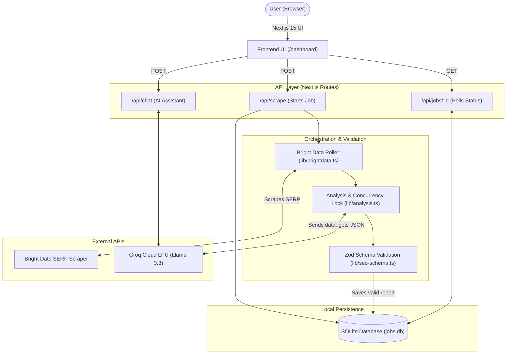

# 🌐 SEO Insight: Developer Guide & README

Welcome to **SEO Insight**! If you are a new developer joining the project, this README contains everything you need to get up to speed quickly. 

## 📖 What is SEO Insight?

In simple words, **SEO Insight** is a fast, local-first search engine intelligence tool. It takes a query (like a brand or website), scrapes live search data using Bright Data's proxy network, and then uses Groq's extremely fast AI (Llama 3.3) to read all that unstructured web data and instantly generate a structured SEO audit report.

Everything is kept **local**. There's no cloud database or SaaS backend storing user data. All reports and scraping jobs are saved securely to a local SQLite database (`data/jobs.db`) on the user's machine.

---

## 🏗️ Functional Architecture

Here is how the entire system connects and flows when a user generates a report:



[👉 **View & Interact with this Architecture Graph in Mermaid Live Editor**](https://mermaid.live/edit#pako:eNqdVU1v2zAM_SuCzlugc9tuO2wHOuzQApsP6EHTgw-2EitRJUWSpN2i6L_PUrKcpF53M0wiqY-v-EhqSyu1kM50P9xV44F1y_jT7X_4iV2gX2Z7b8Cg9_10H7t8z_j4hX0c8I6B6Uu_j7E7-F_70I-_Yuxn7B-z_SfeW8j-uN1n-x3Wn-O_Yyq2_XzX_o6j-6W97z_G6f48Dq9v_w1mEw98a-Pof2F_7z7f-_iFcew__u4f8V125Vn7Y136tT-kG7x-Hfv5s_Wv0T_a8_e4hV9Z529_090_oD1L7Yd8g6d8v0M6yS47eW_R8Y-f_472fW_g-L_f2g--rE_7_w3Xf3x_-4D7581_Oq1h0J-_8L_Ew1_vI__h5m9t99d_2-m_1Qe8fVz5sO2_wQf8t-s_5uN_e0w4j_m9m5v6hHjC_j8D3B_9g_E_mRcfY1_f0R8L42fO_p35e_F9jP__A_z-h_wO8Pv_8g_Yf8-45_1P5s_2T_2H1s_D9X3E_2E_H_f9x_D5f8D-2_4_2_872b_D3t_v9O3_H9R_w8_G8__r2__M_p-3Pz_M9p-2f4c_a_873_-T1o_A_9f_N_G9_9_v_x_8_P4v47eM__h3G_2P7v_c_c_7b3_7O__Yfv7g6c_b1P_5v3_t70_3_u-_T_X_w8_M_5__r4_-v3_t3j_-_f_r4__v3_5u7v_1f_wP__z_s_9H93_u_w8_Tf_r4__Tf_1r4_xP__z_sP__H-3_u_4v4f_D_8Tf9s_5__G_6T_5__2_0P3_8P_Nf9v4__v2P_33_2P7_wH_uP9P)

### Flow Summary
1. User enters a query.
2. The UI calls `/api/scrape` which triggers the **Bright Data API**.
3. We poll Bright Data every 4 seconds until the scrape finishes.
4. The scraped text is compressed and passed to the **Groq AI (Llama 3.3)** to analyze.
5. Groq returns a JSON report, which is strictly validated by **Zod**.
6. The validated report is saved to **SQLite** and the UI automatically redirects the user to view the results.

---

## ⚠️ Important Developer Warnings

> [!WARNING]  
> **Groq Rate Limits & Concurrency Lock**  
> We use the Groq Free Tier. To prevent `429 Too Many Requests` errors, `lib/analysis.ts` has a custom in-memory FIFO queue (Concurrency Lock). **Do not remove this lock**, or multiple rapid scrapes will crash the app by hitting rate limits.

> [!CAUTION]  
> **LLM Output & Zod Validation**  
> LLMs hallucinate structure. **Never** trust raw output from the Groq API. Always pass the response through `seoReportSchema.parse()` inside `lib/seo-schema.ts`. We have strict fallback rules to normalize arrays and missing fields so the UI doesn't crash. 

> [!IMPORTANT]  
> **Payload Size (Token Limit)**  
> Raw scraping data is huge. We use `trimScrapingData()` in the analysis pipeline to cap the narrative text to 8,000 characters and limit citations to 15 sources. If you increase these limits, you will exceed the token window of the AI model and jobs will fail.

---

## 🔌 API Integrations & Developer Guidelines

The project relies on a few critical external APIs to function. Here is exactly how they are used, what you need to know, and what to avoid:

### 1. Bright Data API (SERP & Web Scraping)
- **Purpose:** We use Bright Data's scraping infrastructure to bypass bot protections (like Captchas or Cloudflare) and fetch live Google Search (SERP) results for a given query.
- **Implementation Details:** When a scrape job starts, we don't get data instantly. Bright Data returns a `snapshot_id`. We have a background polling loop in `lib/brightdata.ts` that pings Bright Data every 4 seconds until the status is `ready` and the raw data array is returned.
- **✅ Important:** Since we are a local-first application without a publicly accessible IP, we **cannot use Webhooks**. We *must* use the polling mechanism. Also, the raw JSON response from Bright Data is massive; we use `trimScrapingData()` to shrink it down so it fits into the LLM context window.
- **❌ Avoid:** Do not attempt to pass the raw, untrimmed Bright Data payload directly to the AI. It will immediately exceed token limits and crash the analysis.

### 2. Groq API (Llama 3.3 70B)
- **Purpose:** The core intelligence engine. It reads the unstructured SERP data and converts it into a highly structured JSON SEO report in under 5 seconds. It also powers the interactive AI chatbot.
- **Implementation Details:** We use the Groq SDK with `response_format: { type: "json_object" }` to guarantee we get parseable JSON. Because the Groq Free Tier has strict Requests-Per-Minute (RPM) limits, we implemented a **Concurrency Lock** in `lib/analysis.ts`. This acts as an in-memory FIFO queue so we only process one LLM analysis at a time.
- **✅ Important:** Always validate the output! Even in JSON mode, Llama can hallucinate data structures. The output must instantly be passed through `seoReportSchema.parse()` (using Zod) which applies our defensive fallback values.
- **❌ Avoid:** Do **NOT** remove or bypass the `acquireLock()` and `releaseLock()` mechanism in `lib/analysis.ts`. If multiple background jobs try to hit Groq at the same time, you will get HTTP 429 Rate Limit errors and jobs will fail.

### 3. Google PageSpeed Insights (PSI) API
- **Purpose:** Used to perform technical SEO audits and fetch Core Web Vitals (Performance, Accessibility, Best Practices, SEO) for a given domain.
- **Implementation Details:** It provides a generous free tier of 25,000 requests per day. We query both desktop and mobile strategies to get a complete technical picture.
- **✅ Important:** Make sure to handle potential API timeouts, as PSI can sometimes take up to 20-30 seconds to evaluate a heavy webpage.
- **❌ Avoid:** Do not loop over large arrays of URLs sequentially using PSI without artificial delays, or you might hit burst limits.

### 4. Open PageRank API
- **Purpose:** Retrieves domain authority scores and high-level backlink metrics for competitor analysis.
- **Implementation Details:** Free tier gives 10,000 requests per month. It's a simple, fast REST call that supplements the data we get from SERP results.
- **✅ Important:** Cache these results locally where possible (e.g., in SQLite) if you are querying the same domain multiple times within a short period to save API credits.

### 5. Google Generative AI API (Gemini)
- **Purpose:** An optional fallback LLM pipeline in case Groq experiences downtime or rate limits are exhausted.
- **Implementation Details:** Uses the `@ai-sdk/google` provider.
- **❌ Avoid:** Do not make this the primary inference engine unless necessary. While highly capable, Groq's LPU hardware currently provides the extreme speed (<5 seconds) that SEO Insight's UX relies on.

---

## 🚀 How to Run the Project Locally

We have created an automated Python script to make launching the project as easy as possible. 

### Method 1: The Automated Wizard (Recommended)
Just open your terminal in the project root and run:
```bash
python setup.py
```
*This wizard will check your node version, create an environment file, install dependencies, and launch the server for you automatically.*

### Method 2: Manual Setup

1. **Install Dependencies**  
   We recommend using `pnpm`:
   ```bash
   pnpm install
   ```

2. **Setup Environment Variables**  
   Create a `.env.local` file in the root directory and add your API keys:
   ```env
   # Bright Data API Key (Required for scraping)
   BRIGHTDATA_API_KEY=your_brightdata_api_key_here

   # Groq API Key (Required for AI analysis - Get at https://console.groq.com)
   GROQ_API_KEY=your_groq_api_key_here
   ```

3. **Start the Development Server**
   ```bash
   pnpm dev
   ```
4. **Open the App**  
   Navigate to [http://localhost:3000](http://localhost:3000) in your browser.

---

## 📂 Key Files to Know

- `data/jobs.db`: The SQLite database. This is in `.gitignore` so local data doesn't get pushed.
- `lib/analysis.ts`: The core brain of the app that coordinates Groq inference and database saving.
- `lib/seo-schema.ts`: Contains the TypeScript interfaces and Zod validation logic.
- `Docs/PROJECT_OVERVIEW.md`: A much deeper dive into the architectural decisions, future roadmap, and design system. Read this for a full deep dive!

Happy coding!
